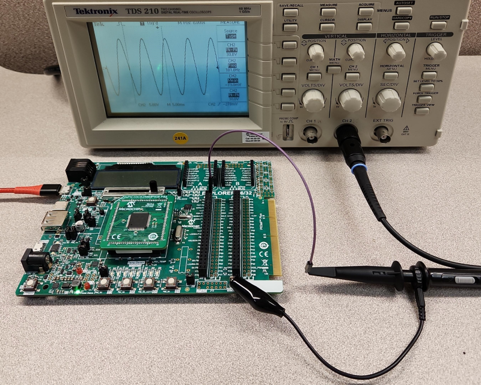
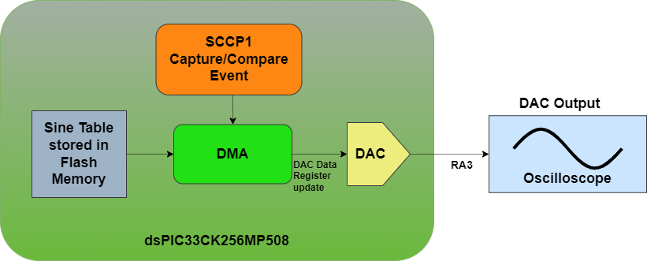
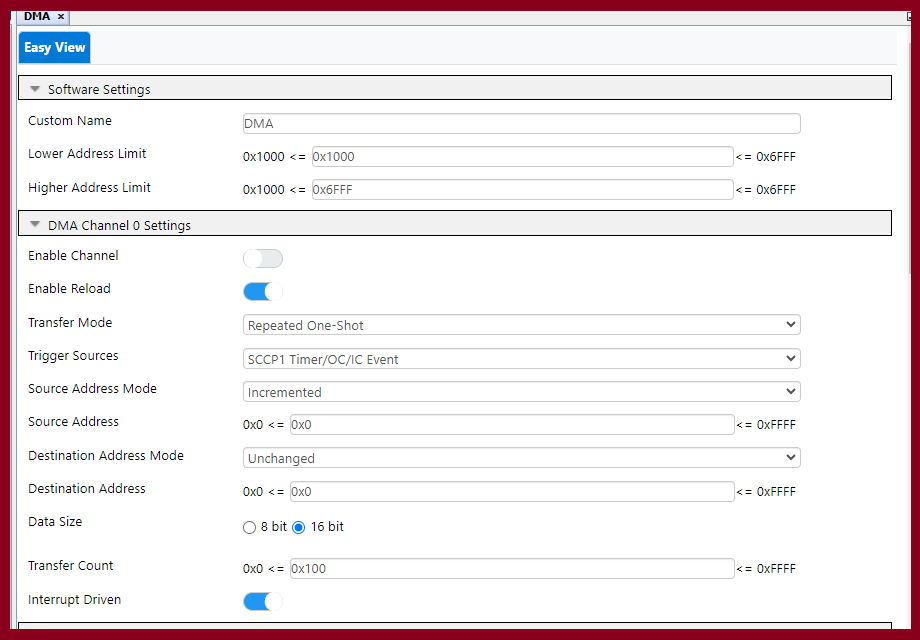
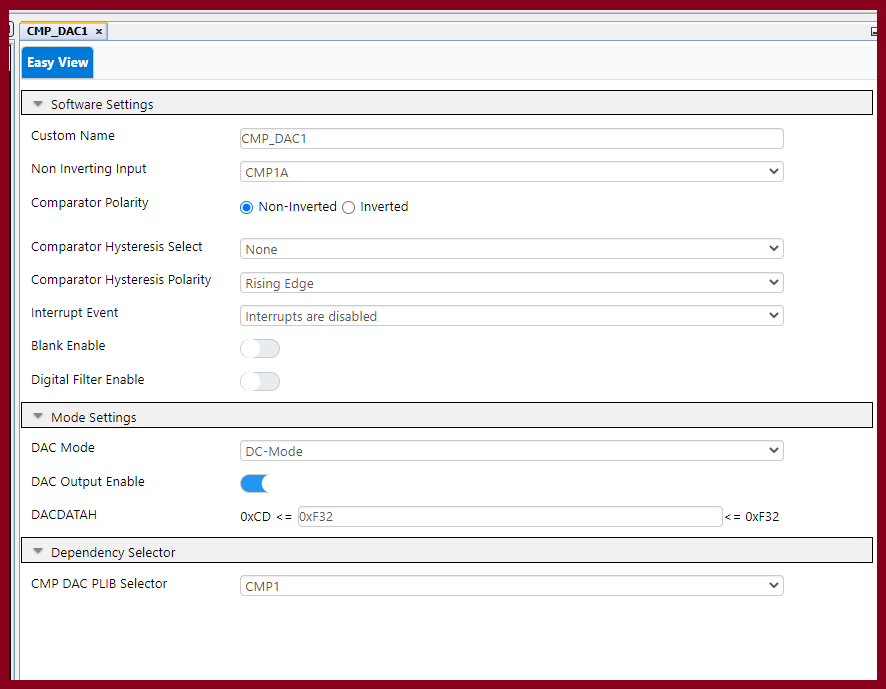
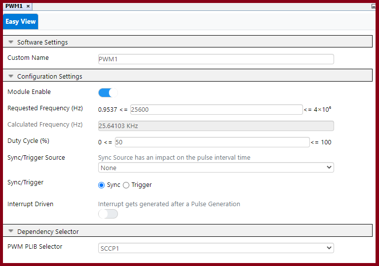
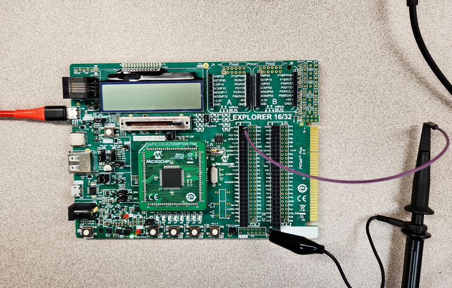
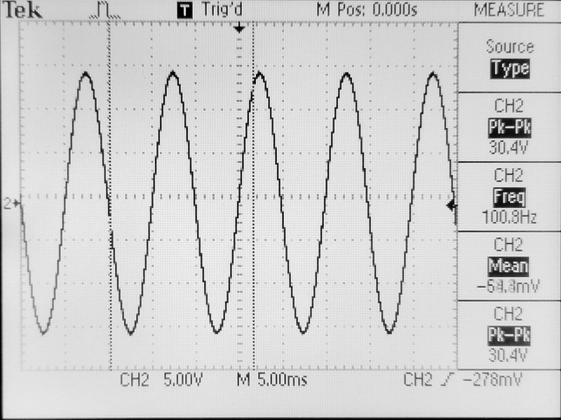

<picture>
    <source media="(prefers-color-scheme: dark)" srcset="images/microchip_logo_white_red.png">
	<source media="(prefers-color-scheme: light)" srcset="images/microchip_logo_black_red.png">
    
</picture>

## Sine Wave Demo

# Summary

This demo demonstrates how to generate a 100 Hz sine wave without CPU intervention using the DMA and DAC peripherals of the dsPIC33CK device. This demo is interchangable between the Explorer Board 16/32 with dsPIC33CK256MP508 PIM and the dsPIC33CK Curiosity development boards (with varying output pins). 

The DMA peripheral will utilize the Capture/Compare event generated by the SCCP module to iterate and place values from a 256 point sine lookup table to a DAC peripheral for output.

## Related Documentation

### DMA Driver
- [DMA Melody Driver Documentation](https://onlinedocs.microchip.com/v2/keyword-lookup?keyword=DMA_16BIT_MELODY_DRIVER&version=latest&redirect=true)

- [DMA FRM Documentation](https://ww1.microchip.com/downloads/aemDocuments/documents/OTH/ProductDocuments/ReferenceManuals/dsPIC33-PIC24-FRM-Direct-Memory-Access-Controller-%28DMA%29-DS30009742C.pdf)

### DAC Driver
- [DAC Melody Driver Documentation](https://onlinedocs.microchip.com/v2/keyword-lookup?keyword=CMP_DAC_Melody_Driver&version=latest&redirect=true)

- [DAC FRM Documentation](https://ww1.microchip.com/downloads/en/DeviceDoc/dsPIC33-PIC24-FRM-High-Speed-Analog-Comparator-with-Slope-Compensation-DAC-DS70005280.pdf)

### PWM Driver (For running the SCCP module in capture/compare mode)
- [PWM Melody Driver Documentation](https://onlinedocs.microchip.com/v2/keyword-lookup?keyword=PWM_16BIT_MELODY_DRIVER&version=latest&redirect=true)

- [SCCP FRM Documentation](https://ww1.microchip.com/downloads/aemDocuments/documents/OTH/ProductDocuments/ReferenceManuals/30003035b.pdf)

# Software Used 
- MPLAB® X IDE  **6.15** or newer (https://www.microchip.com/MPLABXIDE)
- MPLAB® XC16 Compiler **2.10** or a newer compiler (https://www.microchip.com/xc16) 
- MPLAB® Code Configurator (MCC) **5.3.7** or newer (https://www.microchip.com/mcc)
- MPLAB® Code Configurator (MCC) Melody **2.6.3** or newer (https://www.microchip.com/melody)

# Hardware Used
- Debugging tool: MPLAB® PICkit™ 4 In-Circuit Debugger (https://www.microchip.com/PICkit4) **or** PKOB (PICkit On-Board)
- Optional Oscilloscpope or probe to view the sine wave output.
- With either of the selected boards:
    - dsPIC33CK Curiosity Development Board (https://www.microchip.com/dsPIC33CKCuriosity)
    - Explorer 16/32 Development Board (https://www.microchip.com/Explorer1632)
        - dsPIC33CK256MP508 General Purpose Plug-in Module (https://www.microchip.com/MA330042)

# Setup

The sine wave demo uses the Explorer 16/32 Development board or the dsPIC33CK Curiosity Development board.  The boards are plugged in for programming through PKOB(PICkit On-Board) or the PicKit 4. 

The setup for each board is slightly different:
- Explorer 16/32 Development Board
    - dsPIC33CK256MP508 PIM inserted into the designated slot
    - The Sine Wave signal (DACOUT) can be read in on P25
- dsPIC33CK Curiosity Development board
    - The Sine Wave signal (DACOUT) can be read in on RA3

## Software Setup

### Programming the Device
1. Open the dspic33ck_dac_dma_sinewave.X project in MPLAB® X IDE.
2. Right click the project in "Projects" tab of MPLAB® X IDE and select "Set as Main Project".
3. Plug in the PKOB (PICkit On-Board) or the PICKit 4 from the board to the PC.
4. Program the device by selecting the "Make and Program Device (Project dspic33ck_dac_dma_sinewave)" button on the menu bar.
5. The project should build and program successfully.

### Peripheral Configurations
Omitted configurations are default values set by MCC Melody. 

#### 1. DMA Melody Driver's DMA Channel 0 Settings:

|Setting|Value|Explaination|
|---|----|---|
|Enable Channel|False| Starts with channel disabled since it needs to be enabled after SCCP1 in PWM mode is initailized in the main.c.|
|Enable Reload|True|The registers are reloaded to previous values at the next start.|
|Transfer Mode|Repeated One-Shot|This allows the DMA to iterate and transfer data one value per event until it reaches the transfer count.|
|Trigger Sources|SCCP1 Timer/OC/IC Event|This checks for an of the SCCP1 capture/compare event. (Triggered by running SCCP1 in PWM mode) |
|Source Address Mode|Incremented|Increments the Source Address value by the Data Size|
|Source Address|0|This is set within the applicaiton code to use the address of the first sine wave point.|
|Destination Address Mode|Unchanged|This means the destination address will not be affected by the DMA iteration.|
|Destination Address|0|This is set within the applicaiton code.|
|Data Size|16 bit|Sets that transaction size.|
|Transfer Count|0x100|The number of times to iterate in one-shot. (256 points)|

#### 2. DAC Melody Driver

|Setting|Value|Explaination|
|---|---|---|
|DAC output Enable|True|This enables the DACOUT pin.|

#### 3. PWM Melody Driver
- The SCCP1 module is being used in PWM mode to generate an capture/compare event. No pin will be configured as output.

|Setting|Value|Explaination|
|---|---|---|
|Module Enable|True|Enables the PWM module.|
|Requested Frequency (Hz)|25600|This value is calculated based on the number of points to iterate multiplied by the expected output frequecy. *Continued explaination in the explaination section below.|
|Sync/Trigger|Sync|This is set since PWM is not triggered by any external interrupt.|
|Interrupt Driven|Disabled|This is disabled so the ISR does not impact the DMA functionality.|
|PWM PLIB Selector|SCCP1|This generates a capture/compare event being used by the DMA driver.|

#### 3. System Clock Settings
- The Clock settings are configured to the highest possible speed to allow the PWM to work at higher speeds.

|Setting|Value|Explaination|
|---|---|---|
|System Clock Source|FRC Oscillator with PLL|FRC is the hardware clock and PLL is required to enabled the maximum frequency below.|
|Set System(FOSC) Frequency to Maximum|Enabled| This enables the maximum frequency.|

# Operation
After proggraming the device the output can be read off of P25 on the Explorer Board:

After proggraming the device the output can be read off of RA4 on the Curiosity Board:

A 100 Hz sine wave will be present:

## PWM Melody driver's requested frequency explaination

The PWM Melody driver (not hardware peripheral) had to be used due to the DMA expecting the SCCP Capture/Compare event to occur. The DMA Melody driver may say "SCCP1 Timer/OC/IC Event" in some versions of the DMA driver but this is incorrect. The dsPIC33CK256MP508's DMA peripheral will only look for the SCCP1 Capture/Compare Events if this option is selected. 

The SCCP1 capture/compare event (being used as the DMA trigger to update the DAC value) occurs on every falling edge of the PWM. The frequency we select in the PWM driver in Hz represents the number of SCCP1 events per second. Since the sine lookup table is defined, the SCCP1 event needs to occur 256 times per 1 Hz of the expected output to represent the Correct period. This boils down to a multiplication problem:

PWM Frequency (Hz) = Points Length (Sine wave table Length) * Required Output Frequency (Hz)

For example, if there is a need to lower the frequency of the sine wave output to 10 Hz with a 256 point sine wave lookup table updating the PWM to use a frequency of 2560 Hz should represent that output.

**There is however a hardware limit for the PWM requested frequency and the SCCP's interaction with the DMA driver**

When configuring the requested frequency for the PWM there is the calculated frequency listed in Melody. This is done by using the formulas defined by the dsPIC33CK256MP508's datasheet to calculate the period register's values:

For Higher requested frequencies the accuracy of the period is lower. The output compare buffer register is also affected by this due to its formulas:

In testing here are the following values for the Min and Max frequencies for PWM to trigger output compare events for sine wave outputs:

|Requested PWM Frequency|Sine wave output frequency|
|---------------------|----------------------|
|25.6 Hz (Near Minimum requested Frequency)| 0.1 Hz|
|256 Hz|1 Hz|
|2560 Hz|10 Hz|
|25600 Hz| 100 Hz|
|256000 Hz| 1 kHz|
|2560000 Hz| 9.8 kHz|
|25600000 Hz|78 kHz|
|100000000 Hz (Maximum Requested Frequency)|97 kHz|